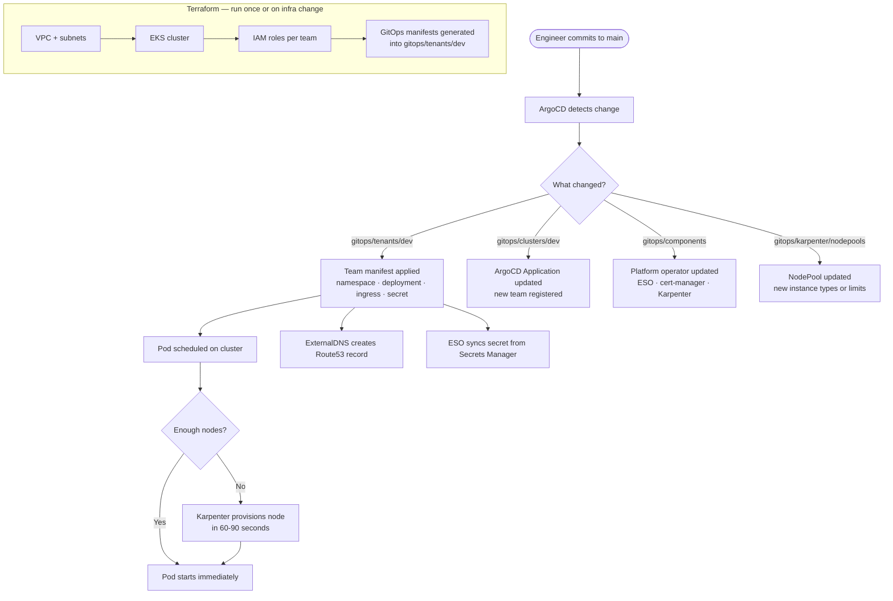

# eks-learning

A production-grade, multi-tenant Kubernetes platform built on AWS EKS (Elastic Kubernetes Service). This repository provisions the full cluster infrastructure with Terraform, manages all platform components and application team workloads through GitOps (ArgoCD), and provides a fully automated tenant onboarding pipeline. It is designed for platform engineers who want a reference implementation of a real-world shared Kubernetes platform, and for application teams who want a self-service path to deploying workloads without managing infrastructure themselves.

---

## Architecture Overview

This platform gives application teams a place to run their workloads without worrying about servers, networking, or secrets management. Here is what it does in plain terms:

- **Infrastructure as code** — the entire AWS environment (network, cluster, IAM roles, DNS) is described in Terraform and can be created or destroyed with a single command.
- **GitOps delivery** — all changes to what runs on the cluster go through Git. ArgoCD watches this repository and automatically applies whatever is committed to `main`. There is no `kubectl apply` in a CI pipeline.
- **Tenant isolation** — each application team gets their own namespace (a private section of the cluster), their own IAM role (so their pods can only access their own AWS resources), and their own secrets path (so one team can never read another team's secrets).
- **Automatic scaling** — Karpenter watches for pods that cannot be scheduled due to insufficient capacity and provisions new nodes (servers) within 60–90 seconds, then removes them when they are no longer needed.
- **Secrets from AWS** — application secrets (database passwords, API keys) are stored in AWS Secrets Manager and automatically synced into the cluster by External Secrets Operator. Teams never manage Kubernetes secrets by hand.
- **Automatic DNS and TLS** — when a team deploys an ingress (a public URL), ExternalDNS automatically creates the DNS record in Route53 and cert-manager provisions a TLS certificate.

---

## Technology Stack

| Tool | What it does |
|---|---|
| **Terraform** | Provisions all AWS infrastructure — VPC, EKS cluster, IAM roles, S3 backend |
| **AWS EKS** | Managed Kubernetes (container orchestration) control plane |
| **ArgoCD** | GitOps controller — watches this repo and keeps the cluster in sync with Git |
| **Karpenter** | Automatic node (server) provisioning and removal based on workload demand |
| **External Secrets Operator (ESO)** | Syncs secrets from AWS Secrets Manager into Kubernetes |
| **AWS Load Balancer Controller** | Creates Application Load Balancers for team ingresses |
| **ExternalDNS** | Automatically creates Route53 DNS records for team hostnames |
| **cert-manager** | Automatically provisions and renews TLS certificates |
| **metrics-server** | Provides CPU and memory metrics used by Horizontal Pod Autoscaler |
| **AWS CloudWatch** | Collects cluster logs and metrics; triggers email alerts on thresholds |
| **AWS Secrets Manager** | Stores team secrets; scoped per-team via IAM |
| **AWS Pod Identity** | Grants pods AWS credentials without static keys (replaces IRSA) |

---

## Repository Structure

```
eks-learning/
├── terraform/
│   ├── environments/
│   │   └── dev/
│   │       ├── main.tf          # Platform-level modules (VPC, EKS, ArgoCD, ESO, etc.)
│   │       ├── tenants.tf       # One module block per application team — edit this to onboard teams
│   │       └── variables.tf     # Input variables for the dev environment
│   ├── modules/
│   │   ├── vpc/                 # VPC, subnets, NAT gateways, route tables
│   │   ├── eks/                 # EKS cluster, managed node group, OIDC provider
│   │   ├── eks-auth/            # aws-auth ConfigMap — controls cluster access
│   │   ├── argocd/              # ArgoCD Helm install + GitHub repo connection
│   │   ├── alb-controller/      # AWS Load Balancer Controller Helm install + IAM
│   │   ├── external-secrets/    # External Secrets Operator Helm install
│   │   ├── external-dns/        # ExternalDNS Helm install + Route53 IAM
│   │   ├── karpenter/           # Karpenter IAM, SQS queue, EventBridge rules
│   │   ├── cloudwatch-alarms/   # CloudWatch metric alarms + SNS email alerts
│   │   ├── team/                # Per-team module: namespace, IAM roles, GitOps manifests
│   │   ├── iam/                 # Shared IAM helpers
│   │   └── irsa/                # Legacy IRSA (replaced by Pod Identity)
│   └── templates/
│       └── gitops/              # Kubernetes manifest templates rendered by the team module
│           ├── namespace.yaml.tpl
│           ├── deployment.yaml.tpl
│           ├── service.yaml.tpl
│           ├── serviceaccount.yaml.tpl
│           ├── ingress.yaml.tpl
│           ├── networkpolicy.yaml.tpl
│           ├── hpa.yaml.tpl
│           ├── resourcequota.yaml.tpl
│           ├── clustersecretstore.yaml.tpl
│           ├── externalsecret.yaml.tpl
│           ├── argocd-application.yaml.tpl
│           └── appproject.yaml.tpl
├── gitops/
│   ├── bootstrap/               # ArgoCD bootstrap — applied once manually to seed the cluster
│   │   ├── base/
│   │   │   └── projects.yaml    # ArgoCD AppProjects (auto-generated by Terraform)
│   │   └── overlays/dev/
│   │       └── app-of-apps.yaml # Root ArgoCD Application — watches gitops/clusters/dev
│   ├── clusters/dev/            # One ArgoCD Application manifest per tenant team
│   ├── components/              # Platform operator ArgoCD Applications (ESO, cert-manager, etc.)
│   │   ├── external-secrets/
│   │   ├── cert-manager/
│   │   ├── metrics-server/
│   │   └── karpenter/
│   ├── tenants/dev/             # Per-team Kubernetes manifests (auto-generated by Terraform)
│   │   ├── test-app/
│   │   └── payments/
│   ├── karpenter/
│   │   └── nodepools/           # Karpenter NodePool and EC2NodeClass definitions
│   └── platform/
│       └── argocd/              # ArgoCD ingress definition
└── docs/
    └── phases/
        ├── README-tenant-onboarding.md   # Full tenant onboarding guide
        ├── README-karpenter-strategy.md  # Karpenter configuration rationale
        └── README-common-commands.md     # Handy operational commands
```

---

## How It Works

The platform uses a layered delivery model. Terraform builds and wires up the infrastructure; ArgoCD takes over from there and keeps everything in sync with Git.



**The flow in three sentences:**

1. A platform engineer runs `terraform apply` once to build the AWS infrastructure and generate all GitOps YAML files for each team.
2. Those files are committed to Git, ArgoCD sees them, and deploys the workloads automatically — no further `kubectl` commands required.
3. From that point on, any change to the cluster goes through a Git commit, giving a full audit trail and the ability to roll back by reverting a commit.

---

## Tenant Onboarding Quick Reference

Onboarding a new application team takes three steps:

**Step 1 — Create the team secret in AWS Secrets Manager**
```bash
aws secretsmanager create-secret \
  --name eks-learning/dev/{team-name}/db-credentials \
  --secret-string '{"username":"user","password":"pass"}' \
  --region us-east-1
```

**Step 2 — Add the team module to `terraform/environments/dev/tenants.tf`**
```hcl
module "team_{team_name}" {
  source         = "../../modules/team"
  cluster_name   = var.cluster_name
  team_name      = "{team-name}"
  environment    = "dev"
  aws_account_id = "684177687615"
  repo_url       = var.github_repo_url
  ingress_order  = 40   # unique per team
  domain_name    = var.domain_name
}
```
Also add the team name to the `teams` list in the `local_file "appproject"` resource in the same file.

**Step 3 — Apply Terraform and push**
```bash
cd terraform/environments/dev
terraform apply
cd ~/git/eks-learning
git add . && git commit -m "feat: onboard {team-name}" && git push origin main
```

Terraform automatically generates all Kubernetes manifests under `gitops/tenants/dev/{team-name}/` including namespace, deployment, service, ingress, network policies, secret store, and resource quota. ArgoCD picks them up and deploys everything within minutes.

See [docs/phases/README-tenant-onboarding.md](docs/phases/README-tenant-onboarding.md) for the full guide including verification steps, network policy details, ingress order reference, and offboarding instructions.

---

## Node Scaling

Karpenter replaces the traditional fixed-size node group. Instead of pre-provisioning a set number of servers, Karpenter watches for pods that cannot be scheduled and provisions exactly the right node for them — within 60–90 seconds.

Two NodePools keep platform and team workloads separate:

| NodePool | Who runs here | Instance types | Spot? | Consolidation |
|---|---|---|---|---|
| `system` | ArgoCD, ESO, CoreDNS, monitoring | t3.medium, t3.large | No — on-demand only | Disabled — stays up |
| `workload` | Application team pods | t3.medium → t3.xlarge, t3a variants | Yes — mixed Spot/on-demand | After 30 min idle |

Platform-level protections are applied automatically so teams do not need to configure anything:
- **LimitRange** — if a pod has no CPU/memory requests, Kubernetes applies a namespace default (100m CPU, 128Mi memory) so Karpenter always has accurate data for scheduling decisions.
- **Consolidation budget** — Karpenter removes at most 10% of nodes at a time, giving workloads time to reschedule gracefully.
- **Node expiry** — nodes are rotated every 30 days for security patching without manual intervention.

See [docs/phases/README-karpenter-strategy.md](docs/phases/README-karpenter-strategy.md) for full configuration rationale and Phase 6 additions.

---

## Observability

**Metrics and logs** are collected by the AWS CloudWatch Observability EKS add-on, which installs CloudWatch Agent and Fluent Bit as DaemonSets on every node. Container logs flow to CloudWatch Logs automatically with no application changes required.

**Alerts** are managed by the `cloudwatch-alarms` Terraform module which creates CloudWatch metric alarms and an SNS topic. Alert notifications are sent by email to the address configured in `var.sns_email`.

| Alarm | Threshold | What it means |
|---|---|---|
| `node-cpu-high` | Configurable (default 80%) | Sustained high CPU across nodes |
| `node-memory-high` | Configurable (default 80%) | Sustained high memory across nodes |

**HPA (Horizontal Pod Autoscaler)** is available per team. When enabled via `enable_hpa = true` in the team module, pods scale out automatically when CPU exceeds 70% or memory exceeds 80% (configurable), up to the configured `hpa_max_replicas`.

---

## Phase Status

| Phase | Description | Status |
|---|---|---|
| Phase 1 | VPC, EKS cluster, node group, baseline networking | Complete |
| Phase 2 | ArgoCD GitOps, app-of-apps bootstrap, platform AppProject | Complete |
| Phase 3 | ALB Controller, ExternalDNS, cert-manager, team ingresses | Complete |
| Phase 4 | External Secrets Operator, AWS Pod Identity, per-team IAM, Secrets Manager | Complete |
| Phase 5 | Karpenter node autoscaling, CloudWatch observability, HPA, resource quotas, network policies | Complete |
| Phase 6 | OPA/Kyverno policy enforcement, system/workload node separation, Spot interruption hardening, Graviton support | Pending |

---

## Prerequisites

Before you can bring this cluster up you will need:

- **AWS account** with an IAM user or role that has admin-level permissions
- **AWS CLI** installed and configured (`aws configure`)
- **Terraform** >= 1.6 installed
- **kubectl** installed
- **Helm** >= 3 installed
- **S3 bucket** for Terraform state — the bucket name in `terraform/environments/dev/main.tf` must exist before `terraform init` (bucket: `eks-learning-tfstate-684177687615-us-east-1-an`)
- **Route53 hosted zone** for your domain (default: `keights.net`)
- **GitHub repository** forked or cloned — ArgoCD pulls manifests from the `github_repo_url` variable

---

## Getting Started

### 1. Clone the repository
```bash
git clone https://github.com/salanisor/eks-learning.git
cd eks-learning
```

### 2. Initialize and apply Terraform
```bash
cd terraform/environments/dev
terraform init
terraform plan -out=tfplan
terraform apply tfplan
```

This creates the VPC, EKS cluster, all IAM roles, installs ArgoCD, External Secrets Operator, ExternalDNS, Karpenter, and the ALB Controller, and generates all GitOps manifests.

### 3. Configure kubectl
```bash
aws eks update-kubeconfig --name eks-learning --region us-east-1
kubectl get nodes
```

### 4. Commit the generated GitOps manifests
```bash
cd ~/git/eks-learning
git add .
git commit -m "feat: initial platform bootstrap"
git push origin main
```

### 5. Bootstrap ArgoCD
```bash
# Apply the AppProjects
kubectl apply -f gitops/bootstrap/base/projects.yaml

# Apply the root app-of-apps (ArgoCD will self-manage from here)
kubectl apply -f gitops/bootstrap/overlays/dev/app-of-apps.yaml
```

### 6. Access ArgoCD
```bash
# Get the initial admin password
kubectl get secret argocd-initial-admin-secret -n argocd \
  -o jsonpath='{.data.password}' | base64 -d

# Open the UI (via port-forward or the ingress at argocd.keights.net)
kubectl port-forward svc/argocd-server -n argocd 8080:443
```

### Spinning down (to save cost)
```bash
# Remove Kubernetes resources first so ALBs and DNS records clean up
kubectl delete ingress -n test-app test-app 2>/dev/null || true
kubectl delete ingress -n payments payments 2>/dev/null || true
kubectl delete ingress -n argocd argocd 2>/dev/null || true
kubectl delete applications -n argocd --all 2>/dev/null || true
kubectl delete nodeclaims --all 2>/dev/null || true

# Wait for ALBs and Karpenter nodes to terminate
sleep 60

# Destroy all infrastructure
cd terraform/environments/dev
terraform destroy -auto-approve
```

See [docs/phases/README-common-commands.md](docs/phases/README-common-commands.md) for additional operational commands including alarm verification and cost checks.
